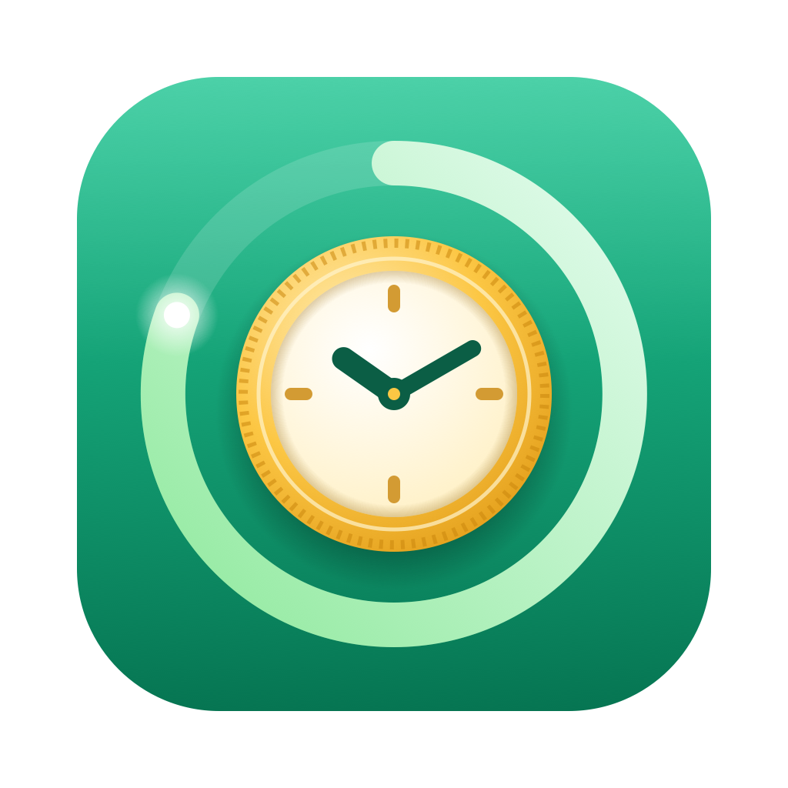

# WealthCounter



A macOS menu bar app that shows the money you've earned today — live, ticking up every second while you work.

## Features

- **Live counter in the menu bar** — today's earnings, updated every second.
- **Real-time dashboard** — click it to watch the number climb with 4 decimals, plus workday progress, this month's total and your hourly rate.
- **Smart schedule** — set your salary (monthly or yearly), work hours and lunch break. Weekends and lunch aren't counted.
- **Wishlist** — add things you want and see how many hours of work they cost and the exact date you'll have earned them.
- **Overtime mode** — keep counting after hours at ×1, ×1.25, ×1.5 or ×2.
- **Lifetime earnings** — everything you've earned since your first day.
- **Celebrations** — confetti when you pass milestones or earn a wishlist item.
- **End-of-day notification** — a summary of what you earned when work ends.

## Install

1. Download `WealthCounter.dmg` from the [latest release](https://github.com/Czarslayer/WealthCounter/releases/latest) and open it.
2. Drag **RealTimeCounter.app** onto the **Applications** folder.
3. The app isn't notarized, so the first time **right-click it → Open → Open**.
   If macOS still blocks it, run:
   ```bash
   xattr -dr com.apple.quarantine /Applications/RealTimeCounter.app
   ```

Requires macOS 14 Sonoma or later.

## Build from source

```bash
./build.sh
```

This compiles the app with Xcode's toolchain, bundles it with its icon, installs it to `/Applications` and launches it.

To package a release installer (`WealthCounter.dmg`):

```bash
./release.sh
```

## How earnings are calculated

Your monthly salary (or yearly ÷ 12) is split evenly across the weekdays of the current month. Each workday's pay builds up second by second during your work hours, skipping lunch. Overtime is paid at your hourly rate × the multiplier you choose and never overlaps regular hours.
